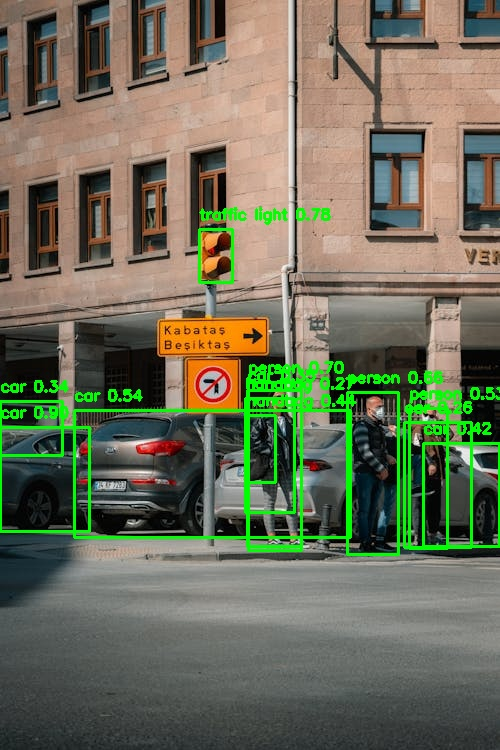

# YOLOv5 Object Detection

## Description
This script uses the YOLOv5 model to perform object detection on an image. It detects common objects like people, cars, and animals, and annotates the image with bounding boxes and labels.

## Requirements
- Python 3.7+
- PyTorch (for running the model)
- OpenCV (for working with images)

You can install the libraries using this command:
```bash
pip install torch torchvision torchaudio opencv-python
 ```

## Installation
1. Clone the repository to your computer.
   ```bash
   git clone https://github.com/your-username/yolov5-object-detection.git
   ```

2. Go into the project folder.
   ```bash
   cd yolov5-object-detection
   ```

3. Install the required libraries.
   ```bash
   pip install -r requirements.txt
   ```


## Usage

1. Place the input image (e.g., `input.jpg`) in the project folder.

2. Run the object detection script:
   ```bash
   python yolov5_object_detection.py
   ```

3. The output image will be saved as `output_annotated.jpg` with bounding boxes around detected objects.


## Sample Output

Here’s an example of what the output image might look like after object detection:


